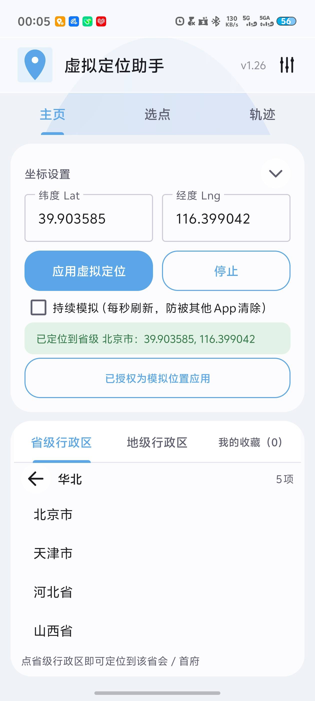
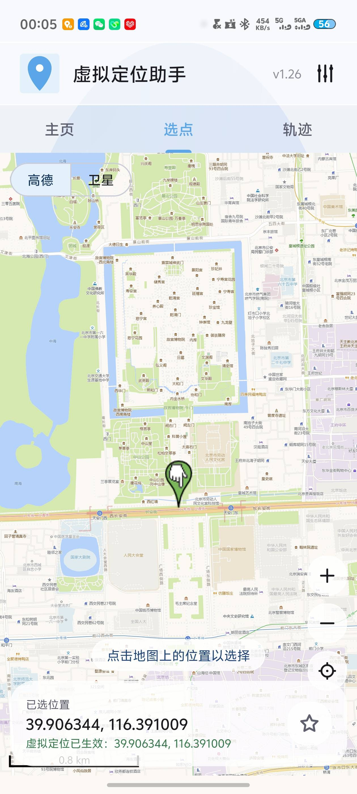
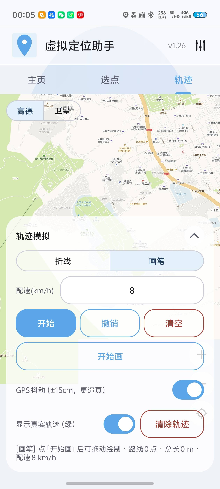
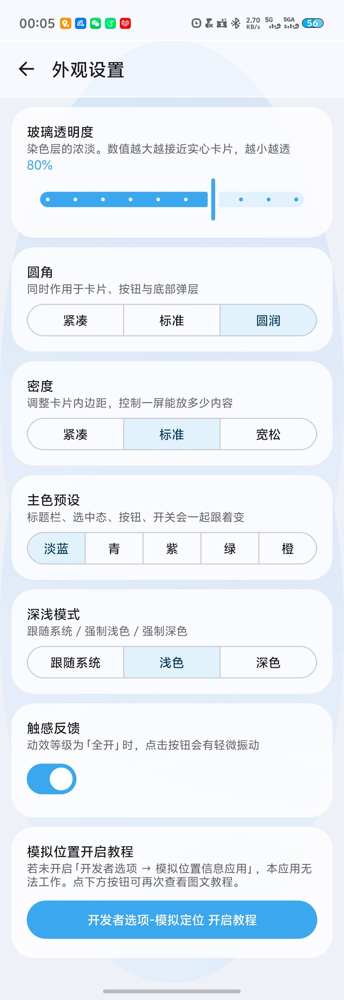

# 虚拟定位助手（Virtual Location Assistant）


一个 Android 应用：把设备的 GPS 位置「改」成你指定的任意坐标，用于 App 测试、位置伪装、自动化脚本调试等场景。
不需要任何地图 API Key，地图瓦片走国内可直连的高德图层，**离线打包即可用**。

核心能力：**坐标定位**（输入 / 地图点选 / 行政区一键跳转）、**轨迹模拟**（折线或手绘路线 + 匀速播放 + 精度抖动）、
**玻璃拟态外观**（透明度 / 圆角 / 密度 / 主色 / 深浅模式可调）。

> ⚠️ 用途提示：本工具依赖系统「模拟位置」能力，只在你已经授权的应用里生效。请仅用于合法合规的测试与开发，不要用于欺骗、欺诈或违反平台规则的行为。

---

## 界面预览

| 主页 | 选点 | 轨迹 | 外观设置 |
|:---:|:---:|:---:|:---:|
|  |  |  |  |
| 坐标输入 / 行政区下钻 / 收藏 | 整屏地图点选，高德·卫星切换 | 折线·画笔规划 + 匀速模拟 | 玻璃拟态、主题、深浅模式 |

---

## 目录

- [一、功能特性](#一功能特性)
- [二、坐标系说明（重要）](#二坐标系说明重要)
- [三、环境要求](#三环境要求)
- [四、安装方法](#四安装方法)
- [五、首次设置：授权模拟位置](#五首次设置授权模拟位置)
- [六、使用指南](#六使用指南)
- [七、常见问题 FAQ](#七常见问题-faq)
- [八、外观设置](#八外观设置)
- [九、版本更新记录](#九版本更新记录)
- [十、技术架构](#十技术架构)
- [十一、行政区划数据来源](#十一行政区划数据来源)
- [十二、免责声明](#十二免责声明)

---

## 一、功能特性

| 功能 | 说明 |
|------|------|
| **手动输入经纬度** | 在「坐标设置」里填纬度 / 经度，点「应用虚拟定位」即可立即生效 |
| **地图整屏选点** | 「选点」页是整屏地图，点哪儿就定位到哪儿（自动换算成 GPS 坐标） |
| **轨迹模拟** | 「轨迹」页用**折线**或**画笔**规划路线，按设定配速匀速跑完，含加速度剖面、精度抖动 |
| **真实轨迹显示** | 模拟过程中把实际走过的路径以绿线叠加在地图上，与规划蓝线对照 |
| **省级行政区一键定位** | 大区 → 省级（34 个），点省级即定位到省会 / 首府 |
| **地级行政区三级列表** | 大区 → 省级 → 地级（共 353 个），点地级即定位到市中心 |
| **收藏夹** | 保存经纬度 + 自定义备注，点条目一键回到该位置；可删除 |
| **持续模拟** | 勾选后每秒重新推送坐标，防止被系统或其他 App 清除虚拟定位 |
| **真实 GPS 显示** | 未启用虚拟定位时，显示设备当前真实 GPS 位置 |
| **图层切换** | 地图页支持「高德矢量 / 卫星」两种底图切换 |
| **强行放大** | 矢量底图放大到 z19–z22（超过瓦片源真实层级）时按 2×/4×/8×/16× 等比放大，不白屏、不重复 |
| **地图工具** | 放大、缩小、回到已选点；底部卡片显示已选坐标与定位状态 |
| **外观自定义** | 玻璃拟态界面，可调透明度 / 圆角 / 密度、主色预设（淡蓝·青·紫·绿·橙）、深浅模式 |
| **崩溃日志** | 闪退时自动把完整堆栈写入 `crash_last.txt`，便于反馈定位问题 |

---

## 二、坐标系说明（重要）

不同地图/系统使用的坐标系不一样，本应用统一按 **WGS-84（GPS 原始坐标）** 对外输入输出：

- **App 输入框、收藏、行政区跳转**：全部使用 WGS-84 经纬度，可直接抄自 GPS 接收机 / 大多数开发文档。
- **高德瓦片**：底图是 GCJ-02（国测局加密坐标）。地图点选时，App 会把你点到的屏幕坐标（GCJ-02）反算成 WGS-84 再写入，保证「点哪写哪」永远准。
- 两者换算由 `CoordUtil` 完成（WGS-84 ↔ GCJ-02 双向，GCJ → WGS 用迭代逼近）。

> 一句话：你看到的、填的、存的，都是 WGS-84；地图只是显示用，内部已自动换算。

---

## 三、环境要求

- **手机系统**：Android 5.0（API 21）及以上。实测 Android 11–15 可用。
- **网络**：地图底图需要联网（Wi-Fi 或流量均可）；虚拟定位本身不需要联网。
- **开发者权限**：必须先在系统「开发者选项」里把本应用设为「模拟位置信息应用」（详见第五节）。
- **构建（可选）**：若从源码编译，需要 JDK 17 + Android SDK（compileSdk 34）+ Gradle 8.9。

---

## 四、安装方法

### 方式一：下载预编译 APK（推荐）

到本仓库的 **Releases** 页面下载最新版 `app-debug-vX.X.apk`（当前为 **v1.30**），传到手机后用文件管理器点击安装即可。

> 请直接安装 `.apk` 文件，**不要**下载 `.zip` 再在手机里解压——手机点 zip 不会把它当作安装包，会提示「无法打开文件」。
> 若必须在手机上传，用电脑解压后将 apk 传进手机再安装。

### 方式二：从源码构建

```bash
# 需要本地已配置好 Android SDK（ANDROID_HOME）和 JDK 17
cd MockGPS
./gradlew assembleDebug
# 产物：app/build/outputs/apk/debug/app-debug.apk
```

用 Android Studio 打开同理：`File → Open` → 选择 `MockGPS` 文件夹 → 等待 Gradle 同步 → ▶ `Run 'app'`。

---

## 五、首次设置：授权模拟位置

虚拟定位依赖系统能力，**必须先在手机上授权本应用**，否则点「应用虚拟定位」会失败并提示。

1. 进入手机 **设置 → 关于手机**，连续点击 **「版本号」** 7 次，开启**开发者选项**。
2. 返回设置，进入 **系统 / 更多设置 → 开发者选项**。
3. 找到 **「选择模拟位置信息应用」**（部分机型叫「模拟位置应用 / Mock location app / 假位置应用」）。
4. 在列表里选中 **「虚拟定位助手」**。
5. 回到 App，输入或点选经纬度，点「应用虚拟定位」即可生效。

> 不同厂商入口略有差异，常见路径：
> - **小米 / Redmi**：设置 → 更多设置 → 开发者选项 → 选择模拟位置信息应用
> - **华为 / 荣耀**：设置 → 关于手机 → 版本号（连点 7 次）→ 系统和更新 → 开发人员选项 → 选择模拟位置应用
> - **OPPO / vivo**：设置 → 关于手机 → 版本号（连点 7 次）→ 系统设置 → 开发者选项 → 模拟位置
> - **三星**：设置 → 关于手机 → 软件信息 → 版本号（连点 7 次）→ 开发者选项 → 模拟位置应用
> - **原生 Android / Pixel**：设置 → 系统 → 开发者选项 → 选择模拟位置信息应用

**验证是否生效**：打开高德 / 百度 / Google 地图等任意导航类 App，看定位是否已变成你设置的位置。

---

## 六、使用指南

App 有三个页面，顶部标签切换（也支持左右滑动）：**主页** / **选点** / **轨迹**。

### 6.1 主页（「主页」标签）

| 区域 | 作用 |
|------|------|
| 坐标设置（WGS-84） | 填纬度、经度，点「应用虚拟定位」生效；点右上箭头可折叠该区域，把整屏让给列表 |
| 持续模拟 | 勾选后每秒重新推送坐标，避免被系统 / 其他 App 清除 |
| 打开开发者设置 | 一键跳到系统「开发者选项」，方便首次授权 |
| 停止 | 关闭测试提供方，恢复真实定位 |
| 状态条 | 显示「未启用 / 虚拟定位生效中 / 真实 GPS」及当前坐标 |
| 行政区 / 收藏 页签 | 见下文 6.4、6.5 |

### 6.2 选点页（「选点」标签）

- **整屏地图**，点任意位置即换算为 WGS-84 并立即应用到虚拟定位，落下蓝色标记。
- 左上角浮层：**高德 / 卫星** 切换底图。
- 右下角按钮：放大、缩小、回到已选点（蓝点准星）。
- 底部卡片：显示已选位置的 WGS-84 坐标 + 虚拟定位状态；右侧 ★ 可把该点收进收藏（带备注）。
- 若「轨迹」页正在模拟，本页会**同时叠加显示实际走过的绿色轨迹**，方便回看。

### 6.3 轨迹页（「轨迹」标签）

用于模拟一段**匀速运动**（跑步 / 开车等）并让虚拟定位沿着它走：

| 控件 | 作用 |
|------|------|
| 折线 / 画笔 | 两种规划方式：**折线**＝依次点击地图落点连成路线；**画笔**＝按住「开始画」后在地图上拖动，手绘任意路径 |
| 配速 (km/h) | 设定巡航速度，有效范围 0.5 – 30，超出会被夹取并提示 |
| 开始 | 校验路线（至少 2 个点）后启动模拟；运行中变为「暂停」 |
| 撤销 / 清空 | 撤销最后一个节点；清空整条路线 |
| GPS 抖动 | 开关。开启后坐标带 ±15cm 级别的随机噪声（贴近真实跑步抖动），关闭则为理想直线 |
| 显示真实轨迹 | 开关。开启后把实际走过的路径以绿线画在地图上 |
| 清除轨迹 | 只清掉绿色实际轨迹，不影响已规划的蓝色路线 |
| 进度提示 | 底部一行显示当前模式、路线节点数、总里程、配速与实时进度 |

模拟过程中：蓝点是当前模拟位置，绿色为已走过的实际轨迹，路线上的绿色小旗是起点。
配速、抖动在运行中也可调整，立即生效。

### 6.4 行政区快速定位

主页有三个页签：**省级行政区 / 地级行政区 / 我的收藏**。

- **省级行政区**：先选「大区」（华北 / 东北 / 华东 / 华中 / 华南 / 西南 / 西北），再列出区内省级行政区，点省级即定位到省会 / 首府。
- **地级行政区**：同样先选大区，再选省级，最后列出该省下辖地级单位（地级市 / 地区 / 自治州 / 盟），点地级即定位到市中心。
- 直辖市（京 / 津 / 沪 / 渝）与港澳**不设地级行政区**，在地级列表里点到它们会直接定位到该行政区中心，不会弹「没有地级行政区」提示；列表里这类条目**不显示右侧箭头**，点前即可区分。

> 行政区坐标来自权威行政中心点（见第十一节），精度到几百米，适合「定位到某市」这类粗粒度需求；要精确定到某个门口，请用选点页手点。

### 6.5 收藏夹（「我的收藏」标签）

- 主页点「收藏当前坐标（可备注）」或选点页点 ★，都会把当前坐标加入收藏，并弹出备注输入框。
- 点收藏条目 → 一键定位到该位置；点右侧垃圾桶 → 删除。
- 收藏数据按应用私有存储持久化（SharedPreferences），重开 App 仍在。

### 6.6 停止 / 恢复真实定位

点主页「停止」即可关闭模拟、恢复真实 GPS。下次想重新模拟，再应用一次坐标即可。

---

## 七、常见问题 FAQ

- **点「应用虚拟定位」没反应 / 提示授权？**
  没在开发者选项里把本应用设为「模拟位置信息应用」，见第五节。
- **地图是灰的 / 空白？**
  手机需要联网加载瓦片（Wi-Fi 或流量均可）。确认网络正常后重进地图页。
- **地图页左右滑没切到下一页？**
  OSMDroid 会优先把横向手势当作平移地图。请直接点顶部标签切换页面。
- **放大到很高级别后线条变粗、变糊？**
  高德底图真实瓦片只到 z18，再往上（z19–z22）是本 App 按 2×–16× **等比拉伸**的，属于预期行为——位置准确，只是清晰度受源数据限制。
- **Android 12+ 找不到「模拟位置」选项？**
  见第五节厂商路径表；系统版本越高，入口越深，但都在「开发者选项」里。
- **换手机或重装后收藏没了？**
  收藏存于本机应用私有数据，卸载会清空（属于正常行为）。
- **行政区跳过去位置偏了一截？**
  极少数数据源可能存在 GCJ-02 / WGS-84 口径差异，影响仅限「列表一键跳转」的绝对位置，地图手点不受影响。如明显偏差请反馈。
- **App 闪退了怎么办？**
  闪退后日志会自动写到
  `/sdcard/Android/data/com.example.mockgps/files/crash_last.txt`
  （部分机型在 `Android/data/…` 下，也可连接电脑用 `adb pull` 取出）。把这个文件反馈即可精确定位问题。

---

## 八、外观设置

点主页右上角 **⋮ → 外观设置** 进入，全部设置即时预览、自动保存：

| 项目 | 可选值 |
|------|--------|
| **玻璃透明度** | 0 – 100%，数值越大越接近实心卡片，越小越通透 |
| **圆角** | 紧凑 / 标准 / 圆润（作用于卡片、按钮与底部弹层） |
| **密度** | 紧凑 / 标准 / 宽松（调整卡片内边距，控制一屏能放多少内容） |
| **主色预设** | 淡蓝 / 青 / 紫 / 绿 / 橙（标题栏、选中态、按钮、开关一起变） |
| **深浅模式** | 跟随系统 / 强制浅色 / 强制深色 |
| **触感反馈** | 开关。开启后点击按钮有轻微振动 |
| **模拟位置开启教程** | 图文教程弹窗（含动图），引导完成系统侧授权 |

---

## 九、版本更新记录

版本号按发布包顺序整理（部分早期版本合并发布）。

| 版本 | 更新内容 |
|------|----------|
| **v1.0 / v1.1**（初始阶段） | 核心功能落地：输入经纬度修改虚拟定位、地图手动点选、显示真实 GPS；首次打包 APK 并自部署构建环境（Gradle + Android SDK）。 |
| **v1.2** | 删除地图搜索功能；新增「省级行政区」列表，一键定位到省会 / 首府；应用图标改为白底蓝标。 |
| **v1.3** | 新增收藏功能：保存经纬度 + 自定义备注，点条目一键回到该位置。 |
| **v1.4** | 省级行政区增加大区二级列表（华北 / 东北 / 华东 / 华中 / 华南 / 西南 / 西北）；新增独立的「地级行政区」三级列表（省 → 地级市 / 地区 / 自治州 / 盟），全部使用官方全称。 |
| **v1.5** | 界面与稳定性优化；行政坐标切换为阿里云 DataV 权威数据源（34 省级、333 地级），统一换算为 WGS-84。 |
| **v1.6** | 改为双页滑动（主页 / 地图选点）；行政区与收藏列表改为占满全屏高度（解决列表显示不全）；地图选点改整屏，支持高德 / 卫星图层切换、缩放、回到已选点。 |
| **v1.7** | 补齐台湾省 20 个二级行政区（6 直辖市 + 3 市 + 11 县）；直辖市、港澳在地级列表中直接定位到中心，不再弹「无地级行政区」提示。 |
| **v1.8** | 修复 v1.7 发布包缺陷：v1.7 的 zip 内 apk 在打包时被截断导致无法安装（「解析软件包时出现问题」）。已校验 zip 内 apk 与源 apk 完全一致、签名完整。 |
| **v1.9** | 地图选点页首次进入（未选点时）自动居中到**真实 GPS 位置**并画蓝点，不再停在世界原点的空白画面；取真实位置优先用 network 提供方（本 App 只覆盖 gps，network 始终是真实位置），避免虚拟定位开启时蓝点跟着跳到假坐标。 |
| **v1.10** | 主题配色由紫色整体改为**淡蓝色**（顶部渐变标题栏、选中标签文字、按钮文字 / 边框、收藏星标等全部换色）；彻底移除点击直辖市 / 港澳时的「XX 不设地级行政区，已直接定位到其中心」提示弹窗，选中后直接静默定位。 |
| **v1.11** | 顶部标题栏由渐变改为**纯色**（`#3BA7EF`），状态栏与标题栏同色，整块颜色统一；移除不再使用的渐变色定义。 |
| **v1.12** | 新增**轨迹模拟**能力：地图页底部「轨迹模拟」面板支持「选点 / 折线 / 画笔」三种模式（顶部 Tab 改为点击切换、关闭左右滑动以防画笔误触翻页）。折线模式依次点节点连直线，画笔模式按住拖动手绘曲线；填配速后按真实经过时间匀速沿路线模拟，含加速度剖面（起步加速 / 匀速 / 减速）、拐点贝塞尔圆角、坐标高斯抖动 + accuracy / 卫星数波动、恒定海拔，地图蓝点实时跟随并显示里程 / 剩余时间。 |
| **v1.13** | 修复三处问题：① 画笔新增「开始画 / 结束画」开关，默认不接管触摸——只有按下「开始画」后拖动才被采集，彻底避免手柄漂移 / 误触画花轨迹，并把采集点夹在地图范围内、去重阈值收紧到 2m；② 地图缩放上限由 19 降到 18（高德瓦片实际只到 z=18，放到 19 级会 404 白屏），缩放按钮同步受限；③ 画笔轨迹不再做贝塞尔圆角（密集采样点做圆角会把轨迹拉歪），改为原样按采样点播放，轨迹与所画路径一致。 |
| **v1.14** | 三大改进：① **轨迹不再乱转**：画笔「结束画」时对采集点做低通平滑（去除手抖锯齿），噪声改为平滑随机游走（蓝点贴着规划线轻微摆动，不再每帧瞬移）；② **精细比例尺**：地图加入随缩放实时更新的米制比例尺，缩放按钮改为半级步进；③ **拆出第 3 个界面**：选点地图与轨迹模拟彻底分离为独立两页（主页 / 选点 / 轨迹），抽出 `BaseMapFragment` 共用地图底座，轨迹页新增「真实轨迹」（绿线）实时叠加在规划路线（蓝线）上对比显示，可一键清除。 |
| **v1.15** | 四项修正：① **轨迹不再混乱**：抖动幅度由 1.5m 降到 **±15cm**（真实跑步 GPS 漂移量级），且包络不超过每秒位移的一半，噪声不再成为位移的 8 倍；新增「GPS 抖动」开关由用户决定是否开启；画笔路线在「结束画」时做**低通 + 抽稀(2m) + 移动平均**三级平滑，锯齿被抹平。② **可放大到更细**：新增 **ESRI World Imagery 高清影像**源（实测 z19 仍是真实影像，高德矢量/卫星在 z19 起已是纯色占位图，上限实为 z18）；地图源切换增加第三个「高清影像」按钮；缩放上限按瓦片源自身层级动态设置，缩放步进细化到 **0.25 级**。③ **修退出重进白屏**：`onDestroyView` 里补 `mapView.onPause()`，`onResume` 时补 `mapView.onResume()` 重新请求瓦片；`ViewPager2` 的 `offscreenPageLimit` 由 2 改 1，避免两张地图同时存在于视图树导致生命周期错配。④ **实际轨迹跨页共享**：实际轨迹提升为 Activity 级共享状态，选点页与轨迹页**都能实时看到绿线**。 |
| **v1.16** | 修「开始后原地不动」：加速度剖面从 0 速度起步导致**数学死锁**——速度按已走里程反推，里程 0 时速度为 0，位移恒为 0，永远自举不起来（表现为里程停在 `0 / 1292 m`）。起步速度改为目标速度的 **35%**，减速段同样保底 35%，保证每 tick 都有位移、能真正跑到终点。已用纯逻辑模拟验证：40km/h 跑 1292m，122 秒到终点。另修：键盘顶飞控制区（`windowSoftInputMode` 改 `adjustResize` + 开始前自动收键盘）；配速限制到 **0.5 ~ 30 km/h** 并夹取提示（原来填 80 会每秒瞬移 22m，轨迹没法看）；配速框加 `maxLength` / `actionDone`。 |
| **v1.17** | 四项调整：① **删除「高清影像」**（ESRI 源）——地图源回到「高德 / 卫星」两个。② **矢量图可强行放大**：`TemplateTileSource` 增加**超限层级降级映射**——声明可服务到 z22，请求层级超过真实的 z18 时按 `x>>k, y>>k` 映射回 z18 瓦片并拉伸绘制（z19 放大 2x、z22 放大 16x），线条变粗但路网位置准确，**不再因为放到 z19+ 而白屏**；缩放上限从 `tileZ+0.75` 放开到 **z22**。③ **修闪退**：切页时 `tick` 回调/画笔 overlay 可能在 Fragment 视图销毁后仍被触发，导致 NPE。已在 `TrackFragment`/`PickFragment` 的 `onDestroyView` 清空全部视图引用（含 `setTrackListener(null)`），并给所有回调加判空。④ **修切回选点页白屏**：`ViewPager2` 存在「`onResume()` 先于 `onCreateView()`」的时序，那时 `mapView` 仍为 null，导致 `mapView.onResume()` 被跳过、瓦片不再拉取。现在 `setupMap()` 末尾额外执行一次 `mapView.onResume() + invalidate()` 兜底。<br>⚠️ **其中②的方案在 v1.18 被判定为错误并重写**（会重复平铺），正确实现见「矢量图强行放大原理」。 |
| **v1.18** | 两项修复：① **修「放大后变成一直重复的地图」**——v1.17 的「超限层级降级映射」方案有误：把 URL 里的 z 改成 18 后，服务端返回的是**一整张 z18 瓦片**，而 osmdroid 会把这张完整图**铺进每一个格子**，于是整屏都是同一张图在重复平铺，而不是放大。正确做法见下方「矢量图强行放大原理」。② **新增崩溃记录器**：把未捕获异常完整堆栈写到 `Android/data/com.example.mockgps/files/crash_last.txt`（含机型、系统、版本号），"切到轨迹页闪退"这类无法在开发机复现的问题可据此精确定位。 |
| **v1.19** | 外观系统重做 + 修四处硬伤：① **修「点击选点 / 轨迹 tab 闪退」**——真凶是布局把 `<Switch>` 换成了 `MaterialSwitch` 后，Java 字段仍是 `android.widget.Switch`，`findViewById` 强转抛 `ClassCastException`（`TrackFragment:67`）；已同步字段类型，`HomeFragment` 的 `CheckBox` 一并预防性改 `MaterialCheckBox`。② **修「崩溃弹窗反复提醒」**——上一版只比对 7 天内的崩溃文件，没有"已读"记录，每次冷启动都重弹；新增 `CrashLogger.markHandled()` 写 `SharedPreferences` 时间戳，分享 / 复制 / 忽略任一按钮都记一次，之后 `mtime <= handled` 不再弹，直到真有新崩溃。③ **修「窗口淡得看不清」**——玻璃卡片同时有 `cardBackgroundColor` 与 `GlassBackdrop` 的 foreground 染色层，两层 70% 白叠成约 85% 白，深色文字浮在上面看不清；已去掉 foreground 层，外观页顶栏三处 `colorOnPrimary` 改 `colorOnSurface`。④ **玻璃拟态对齐 HTML 参考稿**——背景改带色斑的 `bg_page_aurora`，标题栏改半透明 `bg_header_glass`，卡片去掉 stroke 双层描边（消除"边框与中间割裂"）。⑤ **修「窗口过于透明」**——染色时把卡片底色强制覆盖成了全透明，卡片可见遮罩只剩 30% 白；已恢复尊重 `?attr/colorGlassSurface`，默认不透明度 0.60 → 0.80。⑥ **修「点折叠箭头只隐藏按钮、窗口没缩小」**——玻璃底图用内嵌 `ImageView`（`match_parent`）在 `wrap_content` 容器里会被量成满屏高，代码为压制它而把 `LayoutParams` 钉死，导致卡片高度再也无法收缩；改用**不参与测量**的 `background` 承载染色。⑦ **「开始画」时整个控制面板隐藏**，只留底部中央一个「结束画」迷你悬浮窗，把地图完全让给手绘；点「结束画」恢复面板。其中 ⑤⑥⑦ 顺手把 `GlassBackdrop` 整段重写——旧实现那套「抓地图快照 + `RenderEffect` 模糊」模糊的是纯色填充，**没有任何可见效果**，还带来了 ⑤⑥ 两个问题。⑧ **外观设置页精简**：设计风格 / 玻璃强度 / 动效等级都只剩唯一选项（液态玻璃 / 关 / 全开），因此不再生成选择按钮，并移除「恢复默认外观」按钮；历史存过的旧值由 `ThemeManager.migrateDefaultsOnce()` 一次性归位。⑨ **清理三处文案**：删掉顶栏副标题「经纬度 / 行政区 / 选点 / 轨迹 · Mock GPS」，「坐标设置（WGS-84）」→「坐标设置」，「已选位置（WGS-84）」→「已选位置」。⑩ **修「放大超过 z18 后地图闪烁并变全白」**——超限分支原本在源瓦片未就绪时回头去请求 **z19+** 的瓦片，而源只提供到 z18：拿不到真图、失败结果又不进缓存，于是**每一帧都重新请求一次**，屏幕上就是不停闪白；改为只从 z18 开始向更低层级回退取瓦片做裁剪放大，全都未就绪时该格留空。⑪ **「开始画」按钮只在「画笔」模式下出现**（原来是在折线模式下禁用常驻）。⑫ **修「轨迹模拟运行中切到主页闪退」**——轨迹 tick 挂在 Activity 上，而 ViewPager2 会销毁离屏页视图，回调打到「视图已销毁」的 Fragment 时，osmdroid 的 `Polyline` 内部 `LinearRing` 已被 `MapView.onDetach()` 清空，`setPoints()` 直接抛 NPE。现为四层防御：回调内先查 `isAdded()/getView()`、`onDestroyView` 移除监听器不再以 `isAdded()` 为条件（ViewPager2 销毁离屏页时它已是 false）、先把自建图层从 `mapView.getOverlays()` 摘掉再清字段、`notifyTrailChanged()` 对每个 listener 单独 try/catch。⑬ **修「主页经纬度显示 NaN」**——`Double.parseDouble("NaN")` 不抛异常，且 NaN 参与的任何 `<` / `>` 比较都为 false，能绕过全部范围校验；一旦进入共享状态还会自我循环（`fmt()` 写成 "NaN" → 输入框 → `afterTextChanged` 解析回 NaN → 再写回 state）。已在 `MainActivity.fmt()`、`syncStateFromInput()`、`SharedState.set()` 三处挡住非有限值。⑭ **外观设置页把「设计风格 / 玻璃强度 / 动效等级」三张卡片整组删除**（先前只是去掉按钮保留只读展示），`arrays.xml` 里对应的 labels 数组也一并删除。⑮ **删掉外观设置标题栏右侧的「液态玻璃」字样**。⑯ **修「启动图标在圆形遮罩下被切」**——自适应图标的安全区是**直径 66dp 的圆**（半径 33dp），而前景原先缩到 0.9 后上下各伸出 35.4dp，超出圆外；已改为 `scale 0.8`（内容高 14 单位 ≈ ±31.5dp），完整落在圆内。⑰ **根治「放大后闪烁白屏」**——上一版虽已不再请求超限层级瓦片，但 `mTileProvider.getMapTile()` 返回的是受 osmdroid LRU / BitmapPool 管理的可复用位图，随时可能被驱逐或回收；某帧拿不到就只能留空，而 `MapView` 每帧先铺背景色再画瓦片，于是"一闪一闪的白"。现改为**把成功取到的源瓦片 `copy()` 一份存进自有 LRU 缓存**（16 张 ≈ 4MB），此后每帧都命中本地副本，不再受 osmdroid 缓存策略影响；切换地图源时清空该缓存（`switchTileSource`），`onDetach` 时释放。⑱ **修「轨迹运行时点清空 / 点开始闪退」（第二处 NPE 同源）**——用 `javap` 反编译 osmdroid 6.1.18 确认：`PolyOverlayWithIW.setPoints()` 的第一条指令就是 `mOutline.setPoints(...)`，**没有任何 null 检查**；而 `mOutline` 全类只在 `onDetach()` 里被置空（`usePath()` 是重建），并且它是 `protected`、跨包探测不到。也就是说一个 Polyline 只要经历过 `MapView.onDetach()` 就"半死"，而且没法从外部判断。改为**写点自愈**：`try { setPoints } catch (NullPointerException) { 从地图摘掉 → 重建一个 → 重写 }`（`TrackFragment.writePoints()`）。⑲ **修「切回轨迹页蓝线 / 绿线消失」**——ViewPager2 下新页可能是「先 `onResume`、后 `onCreateView`」，那时 `mapView` 还是 null，`onResume` 里的重画被直接跳过；已在两个 Fragment 的 `onCreateView` 末尾各补一次重画。⑳ **修「切到选点页地图是白的」**——`onCreateView` 每次都会 inflate 出**新的** `MapView`，而**它的中心默认是世界原点 (0,0)**（几内亚湾海面，屏幕上一片空白），`setZoom()` 并不改变这一点；现在 `setupMap` 末尾按「① 上次记下的中心 → ② 已选坐标 → ③ 真实位置」摆一次中心，并在 `onDestroyView` 里把中心记下来供下次恢复（切页回来不跳位置）。㉑ 选点页的绿线同样加了自愈。㉒ **修「轨迹运行时点『清空』闪退」**——`startTrack()` 里有一句 `state.valid = true`，把 `valid` 直接置真而 `lat`/`lng` 还是初始的 `Double.NaN`（三个字段互相独立）；轨迹跑起来后点「清空」→ `isRunning()` 变 false → tick 落到 `else if (state.valid)` 分支 → **把 NaN 推给系统定位**。而 vivo 定制 ROM 会在 `setTestProviderLocation` 链路里对 `Location` 做加密，内部把字段转字符串再 `Integer.parseInt` —— 拿到 `"NaN"` 直接抛 `IllegalArgumentException`（还是在 system_server 里抛，应用侧只看到 `RemoteException`）。修法三处：删掉那句直接赋值、tick 改用 `state.isUsable()`、`pushLocation()`/`pushTrackPoint()` 对**每个字段**做有限值兜底（`Location.toString()` 会遍历所有字段，`accuracy`/`speed`/`bearing` 是 NaN 一样会踩到）。㉓ **修「切走再切回，地图上的播放蓝点消失」**——那个 Marker 属于页面、每次 `onCreateView` 重建，而轨迹 tick 挂在 Activity 上照跑，所以回来时它是个全新的、不可见的 Marker；新增 `MainActivity.lastTrackPoint` + `TrackFragment.restorePlaybackMarker()` 把它摆回原位（`onCreateView` 与 `onResume` 都调）。 |
| **v1.20** | 承接 v1.19 的外观系统改造，把发布后暴露的 **20+ 项真机问题逐条修掉**并收口（明细见交付包 `00-先读我.md` 的 3.4 / 3.5 表；`AGENTS.md` 第 6.5 / 9.5 节有完整技术分析）。四类根因：① **图层生命周期**——`Polyline` 一旦被 `MapView.onDetach()` 过，内部 `LinearRing` 就被清空，再调 `setPoints()` 必崩 NPE（用 `javap` 反编译 osmdroid 6.1.18 确认其**无 null 检查**、且 `mOutline` 跨包探测不到），改为**写点自愈**；② **NaN 链路**——`Double.parseDouble("NaN")` 不抛异常，而 `valid` 又能脱离 `lat`/`lng` 单独为真，曾把 NaN 推给系统定位，在 vivo 定制 ROM 上被 `Location.toString()` 的加密逻辑 `Integer.parseInt("NaN")` 抛崩，已在 setter / 输入校验 / `fmt` / 推送前四处挡住；③ **地图渲染**——超限层级不再请求不存在的瓦片 + 自带**源瓦片副本缓存**（治"放大后闪烁白屏"）、新建 `MapView` 后必须按「上次中心 → 已选坐标 → 真实位置」摆正中心（治"切页后地图一片空白"）；④ **UI**——外观设置页只留必要项、启动图标按 **66dp 圆形**安全区重算、**轨迹按钮合并为「开始 / 停止 / 继续」三态**（跑完或按「清空」自动回到「开始」）。 |
| **v1.21** | 轨迹绘制体验两项修正 + 文档修正：① **修「折线模式未点『开始设点』也能加点」**——`onMapTap` 加节点现在用 `polyAdding` 门控，只有点过「开始设点」后点地图才加节点，没进入设点态时点地图不做任何事，避免误触乱加节点；② **修「开始画 / 开始设点后地图仍可单指平移」**——绘制态触摸接管从已被摘掉的 `FreehandOverlay` 改为 `MapView.setOnTouchListener` 并真正挂上监听（上一轮漏了调用），单指拖动被消费（地图不平移、同时采点），双指仍放行给缩放检测器（`ACTION_DOWN` 故意不消费以保留双指缩放识别）；③ **修正 README 版本历史表排序**（v1.14–v1.20 升序）。 |
| **v1.22** | 去掉自动授权 / 无障碍相关能力，改用手动教程：① **删除自动授予模拟位置的无障碍服务**（`MockLocAccessibilityService` 及其配置、相关导出节点树代码），以及所有依赖无障碍的"一键授权"逻辑——系统不允许应用代开开发者选项，自动授权本就不可靠且需敏感权限；② **保留「前往开发者选项」按钮**（主页），点击直接跳转系统开发者选项页，用户在「选择模拟位置信息应用」里手动选中本 App；③ **新增开屏教程**：检测到未选中本 App 为模拟位置应用时，开屏自动弹出 GIF 教程弹窗（标题固定为「开发者选项-模拟定位 开启教程」，带「关闭」与「前往开发者选项」按钮，每个进程最多弹一次）；④ **外观设置页新增手动按钮**「开发者选项-模拟定位 开启教程」，可随时重新查看该教程；⑤ GIF 用 `android.graphics.Movie` 在自定义 `GifView` 里循环播放，零三方库依赖，资源放 `assets/dev_tutorial.gif`。 |
| **v1.23** | 修「轨迹模拟运行中切到主页再切回轨迹页，蓝点 / 绿色起点 / 绿色已走轨迹丢失」：① 根因一——`TrackFragment` 的 `redrawRoute()` / `redrawTrail()` / `restorePlaybackMarker()` 用 `getView() == null` 把关，而 `onCreateView` 里为了"切回立刻补画"调用它们时 `getView()` 仍为 null，导致这三次补画被静默跳过；去掉 `getView()` 这一项，只保留 `isAdded()` 与 `mapView == null` 判空，`onCreateView` 与 `onResume` 都能正常补画；② 根因二——`BaseMapFragment` 的地图中心是实例字段，切页 Fragment 被销毁重建后中心退回世界原点 (0,0)，轨迹整体被甩到屏幕外像"没了"；改为按**子类类名**缓存的静态表，跨重建仍保留上次中心，切页 / 转屏回来都不跳位置；③ `restorePlaybackMarker` 改为"有最后一点就显示蓝点"，暂停 / 已到终点切页回来蓝点也停在最后位置（不再只在运行中才显示）。 |
| **v1.24** | v1.23 仍未彻底修好：真机实测切回轨迹页蓝点 / 绿起点 / 绿轨迹仍不显示。追加两处根因：① **重建后补画时机太早**——`onCreateView` 里直接 `invalidate()` 时，新 `MapView` 还没完成测量 / attach，osmdroid 在 ViewPager2 重建场景下几乎必然画不出 overlay（经典坑）；改为 `view.post()` 把整组重画推迟到布局完成后，保证投影尺寸就绪、overlay 真正渲染；② **三个重画顺序耦合**——原来 `onResume` 里 `redrawRoute()` → `redrawTrail()` → `restorePlaybackMarker()` 顺序写在同一段，只要 `redrawRoute()` 抛一次异常被外层 `catch` 吞掉，后面两个整段被跳过（正好对应"蓝点 + 绿起点 + 绿轨迹一起消失"，而蓝色规划线因写在最前反而还在）。新增 `redrawAll()` 把三次重画各自独立 try/catch，`onCreateView`(post) 与 `onResume` 都走它，任一失败不影响其余两个。 |
| **v1.25** | 诊断版（不改行为，只加日志）：为定位 v1.24 若仍不修复的真实原因，新增 `DiagLog` 诊断日志类——在轨迹页的 `onCreateView` / `onResume` / `redrawAll` / `onDestroyView` 及 `BaseMapFragment.setupMap` 中心恢复处记录**地图宽高（判断是否还没布局）、各图层是否为空、路线 / 轨迹点数、每个标记最终 visible、任何异常的完整堆栈**；写入三处：应用专属目录 `diag.txt`、公共 `Download/MockGPS-diag/diag.txt`（文件管理器直接可见）、logcat（TAG `MockGPS-DIAG`）。用户复现后取回该文件即可精确定位，不用再猜。 |
| **v1.26** | 依据 v1.25 诊断日志定位到真凶并修复：日志显示切页全程**无 `onDestroyView`**（轨迹页根本没被销毁重建，之前的"重建修复"方向是错的），且 `setupMap` 时中心是 `0,0`。真因是 `BaseMapFragment.onResume` 里的 `centerOnRealIfIdle(true)`——轨迹模拟期间 `state.valid=false`、`state.lat=NaN`（`startTrack` 有意不写 state），于是每次切回轨迹页它都把地图中心拽回**真实 GPS 坐标**，而用户画的假路线在别处，路线/蓝点/绿线全被甩到屏幕外，看起来像"消失"。修复：`TrackFragment` 覆盖 `centerOnRealIfIdle`，**只要已有一条路线（`nodeCount()>=1`）就绝不自动回真实位置**，没有路线时才沿用基类默认。同时 `redrawAll` 日志补记地图中心，便于复核。 |
| **v1.27** | 修「轨迹模拟运行中切回轨迹页，蓝点 / 绿色起点 / 绿色已走轨迹不显示」：tick 回调节点（播放蓝点置可见）后补 `mapView.invalidate()`；`redrawOnLayout` 由同步 `redrawAll()` 改为 `mapView.post(() -> redrawAll())`（等布局完成再画，解决 ViewPager2 重建场景下 `MapView` 未 attach、overlay 未及时渲染的经典坑）；`onCreateView` 末尾三重保险（`onGlobalLayout` 内 `post` + 直接 `post` + `postDelayed(250)`），`onResume` 末尾 `postDelayed(() -> redrawAll(), 250)` 兜底。版本号 1.27。 |
| **v1.28 – v1.30** | 新增「轨迹模拟运行中禁止切页」：运行时点击顶部「主页 / 选点」Tab 不再跳转，仅 Toast 提示「请先停止模拟轨迹」；暂停 / 停止 / 自然结束后自动恢复切页。实现迭代：① v1.28 在 `onTabSelected` 里 `tab.select()` 弹回轨迹页，vivo 上因 `TabLayoutMediator` 双向同步触发 `onTabSelected` 递归 `StackOverflowError`；② v1.29 改用 `setCurrentItem(2)` 回锁，但 Tab 点击先切走、回锁被覆盖，只剩弹窗没真正拦住；③ v1.30 改为在 `refreshNavLock()` 中给每个 Tab 视图挂 `OnTouchListener` 返回 `true` 直接吞掉触摸事件，从源头禁用一切切页操作，无递归、无切走。版本号 1.28 → 1.30。 |

---

## 十、技术架构

- **语言 / 构建**：Java 17，Gradle 8.9，`minSdk 21` / `targetSdk 34`，已开启脱糖（desugaring）。
- **虚拟定位核心**：`LocationManager.addTestProvider()` + `setTestProviderLocation()`，覆盖系统 `gps` 提供方；`ACCESS_MOCK_LOCATION` 权限让本 App 出现在系统「选择模拟位置信息应用」列表。
- **三页容器**：`ViewPager2` + `FragmentStateAdapter` + `TabLayoutMediator`，承载 `HomeFragment`（主页）/ `PickFragment`（选点地图）/ `TrackFragment`（轨迹模拟）。`offscreenPageLimit=1`，`userInputEnabled=false`（改用顶部 Tab 点击切换，避免地图手势误触翻页）。
- **地图基类**：`BaseMapFragment` 封装选点页与轨迹页共用的地图基础设施（瓦片源、比例尺、真实蓝点、缩放按钮、生命周期）；子类只实现 `onMapTap` / `onCenterClicked` / `addExtraOverlays`。
- **地图**：`org.osmdroid:osmdroid-android:6.1.18`，`MapEventsOverlay` 处理点击选点；瓦片走自定义 `TemplateTileSource`（支持 `{x}{y}{z}` 任意位置占位符）。
- **轨迹引擎**：`TrackEngine` —— 路线节点（WGS-84）→ haversine 里程 → 按真实经过时间（`elapsedRealtimeNanos`）匀速插值 → 加速度剖面 → 精度抖动。跨页共享的实际轨迹由 `MainActivity.sharedTrail` 持有。
- **坐标换算**：`CoordUtil` 实现 WGS-84 ↔ GCJ-02（GCJ → WGS 用迭代逼近）。
- **收藏持久化**：`FavoriteStore` 用 SharedPreferences 存储 JSON 数组（经纬度 + 备注）。
- **外观系统**：`ThemeManager`（设置读写 + 主题应用）、`AppearanceActivity`（外观设置页）、`GlassBackdrop`（玻璃卡片染色，用不参与测量的 `background` 承载，避免影响 `wrap_content` 收缩）、`Motion`（动效）、`DevSettings` / `DevTutorialDialog`（开发者选项与教程弹窗）、`GifView`（用系统 `Movie` 播放 GIF，零三方库）。
- **诊断**：`CrashLogger`（未捕获异常写 `crash_last.txt`）、`DiagLog`（轨迹页布局 / 图层诊断日志）。
- **主要源码**：
  - `MainActivity.java` —— 三页容器 + 模拟定位引擎 + 跨页共享状态
  - `TrackEngine.java` —— 轨迹模拟引擎（插值 / 加速度剖面 / 抖动 / 平滑）
  - `BaseMapFragment.java` —— 地图页基类（瓦片源 / 比例尺 / 缩放 / 生命周期）
  - `ScalingTilesOverlay.java` —— 超限层级裁剪放大（「矢量图强行放大」的核心实现）
  - `CrashLogger.java` / `DiagLog.java` —— 崩溃与诊断日志
  - `ThemeManager.java` / `AppearanceActivity.java` / `GlassBackdrop.java` / `Motion.java` / `GifView.java` —— 玻璃拟态外观系统
  - `DevSettings.java` / `DevTutorialDialog.java` —— 开发者选项与模拟位置教程
  - `HomeFragment.java` —— 主页（坐标输入、行政区下钻、收藏）
  - `PickFragment.java` —— 选点页（并叠加显示实际轨迹）
  - `TrackFragment.java` —— 轨迹模拟页（折线 / 画笔 / 播放）
  - `CoordUtil.java` —— 坐标换算
  - `FavoriteStore.java` —— 收藏持久化
  - `DivisionData.java` —— 行政区数据（自动生成）

### 瓦片层级与「强行放大」原理

放大白屏的根因是**瓦片源并不提供的层级被请求后返回占位图**。以下是逐级实测结果
（同一地点，判据：返回 200 且图像非单一纯色）：

| 瓦片源 | z17 | z18 | z19 | z20 | 真实上限 |
|---|---|---|---|---|---|
| 高德矢量（`webrd0*.is.autonavi.com`） | 真实 | 真实 | **纯色占位**（179B / 1 色） | 纯色占位 | **z18** |
| 高德卫星（`webst0*.is.autonavi.com`） | 真实 | 真实 | 纯色占位（4235B / 49 色） | 同左 | **z18** |

即：**高德两类瓦片的真实数据都只到 z18**，z19 起服务端返回的是纯色占位图，
直接请求就会得到整屏单一色块（表现为「白屏」）。

#### 错误做法（v1.17，会导致「一直重复的地图」）

把 URL 里的 `z` 改成 18 就交给 osmdroid 绘制：

```
getTileURLString(z22, x, y) → 请求 (z18, x>>4, y>>4) → 得到一整张 z18 图
```

osmdroid 的绘制流程是「**拿到 drawable → 填满当前格子的屏幕矩形**」：

```
TilesOverlay.drawTiles()
  └─ TileLooper.loop(zoom, viewPort, canvas)
       mTileZoomLevel = floor(zoom)                 // 例如 22
       for x,y in 覆盖视口的格号:
           tileIndex = MapTileIndex.getTileIndex(mTileZoomLevel, mod(x,W), mod(y,W))
           handleTile(tileIndex, x, y)              // x,y 是原始格号（未取模）
  └─ handleTile():
       drawable = provider.getMapTile(tileIndex)
       projection.getPixelFromTile(x, y, rect)      // rect = 该格屏幕矩形
       onTileReadyToDraw(canvas, drawable, rect):
           drawable.setBounds(rect); drawable.draw(canvas)   // ← 整张图塞进这一格
```

`Projection.getPixelFromTile` 里的格宽是 `mTileSize = 256 × 2^(zoom − floor(zoom))`，
在整数层级下就是 256px。所以拿到一整张 z18 图、把它填进 256px 的 z22 格子，
结果是**每个格子都显示完整的 z18 地图** → 整屏同一张图无限重复平铺。

#### 正确做法（v1.18：裁剪 + 缩放，`ScalingTilesOverlay`）

超限时不做「整图铺」，而是取 z18 源瓦片的**对应 1/2^k 子区域**再缩放填入当前格。
裁剪数学取自 osmdroid 自身的 `MapTileApproximater.approximateTileFromLowerZoom`：

```
k = z - 18;  subSize = 源图边长 >> k
srcX = (x & (2^k − 1)) × subSize
srcY = (y & (2^k − 1)) × subSize
src  = Rect(srcX, srcY, srcX + subSize, srcY + subSize)
dst  = 当前格的屏幕矩形（projection.getPixelFromTile(x, y)）
canvas.drawBitmap(源位图, src, dst)
```

于是 2^k × 2^k 个格子各自取到 z18 图**不同**的 1/2^(2k) 区域，拼合起来正好是
**一整张 z18 图被等比放大 2^k 倍**——不是重复，而是真正的放大。

> 实现要点：`ScalingTilesOverlay` 继承 `TilesOverlay` 并重写 `drawTiles()`，
> 用自定义 `TileLooper`（`TileLooper` 是 public 可继承的）替代默认的
> `OverlayTileLooper`（private 内部类，且 `onTileReadyToDraw` 收不到 tileIndex，
> 无法得知该画源图的哪一块）。通过 `mapView.getOverlayManager().setTilesOverlay(...)`
> 安装；`MapView.setTileSource()` 只换 provider、不动 overlay，所以切换底图时二者不冲突。
> 缓存按**源层级索引**存放，2^k × 2^k 个格子共享同一张 z18 位图，不会重复占内存。

放大倍率一目了然：z19 = 2×，z20 = 4×，z21 = 8×，z22 = 16×。线条会变粗变糊，
但路网位置**完全准确**。缩放上限固定为 z22，配合 0.25 级步进可连续放大。

---

## 十一、行政区划数据来源

`DivisionData.java` 由生成脚本产出，两个来源：

| 范围 | 来源 | 坐标系 | 处理 |
|------|------|--------|------|
| 34 个省级、**333** 个地级 | 阿里云 DataV GeoAtlas（`areas_v3/bound/{adcode}_full.json`），按 `adcode % 100 == 0` 精确筛选 | GCJ-02 | 换算为 WGS-84 |
| 台湾省 **20** 个二级行政区（6 直辖市 + 3 市 + 11 县） | `chinese-global-compliant-geodata` 内的 `chn-tw-level-2.json`（原始出处 GeoJSON.CN） | WGS-84（文件自述） | 直接使用，不换算 |

**为何要补台湾**：DataV 的 `710000_full.json` 返回 404、`childrenNum` 为 0，即 DataV 未收录台湾省下级单位。补录的 20 条已做自洽性校验——每个 `center` 都落在各自的行政边界多边形内。

---

## 十二、免责声明

本软件仅供**学习、测试与合法开发调试**使用。使用者须自行确保：

1. 仅在自己拥有或已获授权的设备上使用；
2. 不用于任何欺骗、欺诈、绕过平台风控或违反法律法规的行为；
3. 因不当使用导致的账号封禁、违约等后果，由使用者自行承担。

作者不对本软件的任何使用后果负责。
